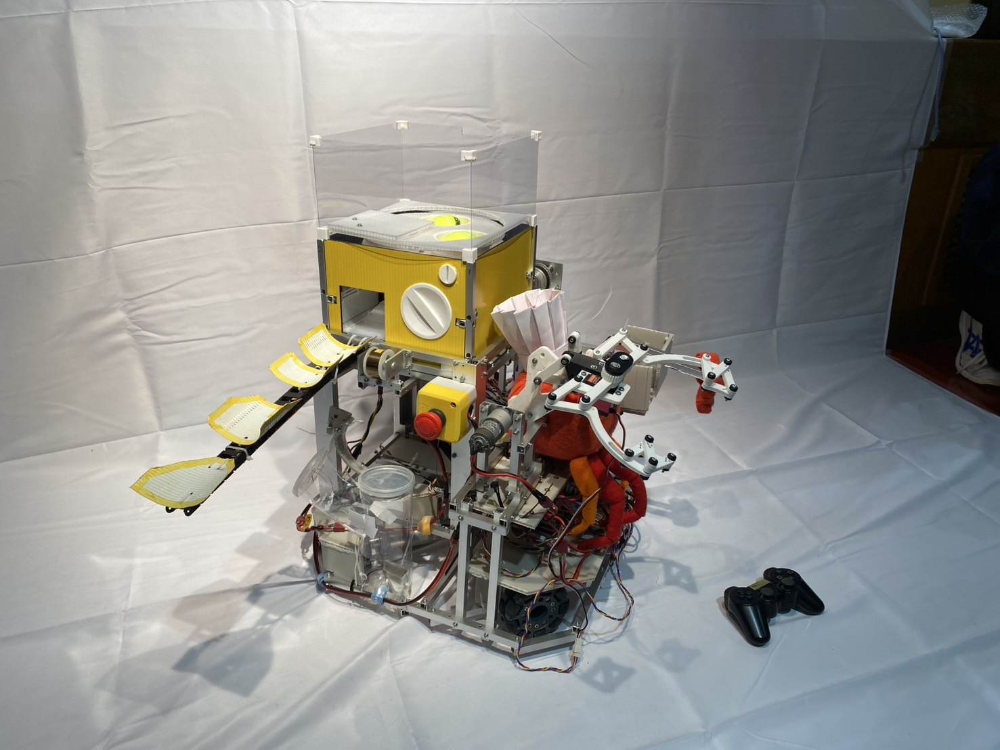

# ROBOCON
ロボコン用リポジトリです。 
2023KYOROBO：2023年度九州共同ロボコン出場時の回路及びプログラム 
2023HONROBO：2023年度高専ロボコン出場時の回路及びプログラム 
の成果物を入れています。 
  
# 画像
2023九州共同ロボコン

  
2023高専ロボコン

  
# ディレクトリ構成
<pre>
├─2023HONROBO(2023年高専ロボコン)
│  ├─circuits
│  │  ├─CAN_bus(CAN通信バスをまとめる用)
│  │  │  └─can_bus
│  │  │      ├─canBus_plot
│  │  │      └─can_bus-backups
│  │  ├─main_board(メイン基板)
│  │  │  ├─ESP32_Devkit_V1.pretty
│  │  │  ├─main
│  │  │  └─main_board-backups
│  │  ├─undercarriage_system(足をまわり用基板)
│  │  │  ├─undercarriage2_plot
│  │  │  └─undercarriage_system-backups
│  │  └─undercarriage_system_thread(足をまわり用基板のモタドラスレッドver)
│  │      ├─plot
│  │      └─undercarriage_system-backups
│  └─sources
│      ├─2023_HONROBO_Harvest
│      ├─2023_HONROBO_main
│      └─2023_HONROBO_Wheels
└─2023KYOROBO(2023年九州共同ロボコン)
    ├─circuits
    │  ├─nucleo_446re.pretty
    │  └─NUCLEO_F446.pretty
    └─sources
</pre>
  
# 開発環境
|          |     |
|   :-:    | --- |
| OS(PC)   | Windows 10 Pro |
| OS(マイコン) | mbed-os 5.15.7, 6.13.0 |
| IDE      | Arm Keil Studio |
| HARD     | NUCLEO-F446RE, NUCLEO-F303K8 |
| LANG     | C++ |
